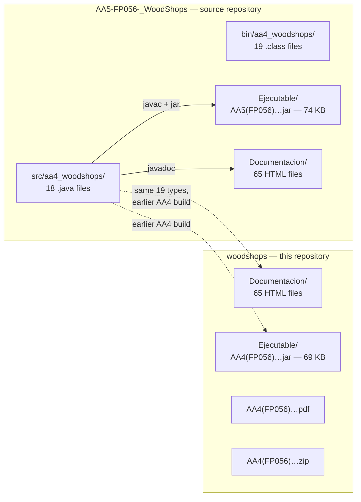
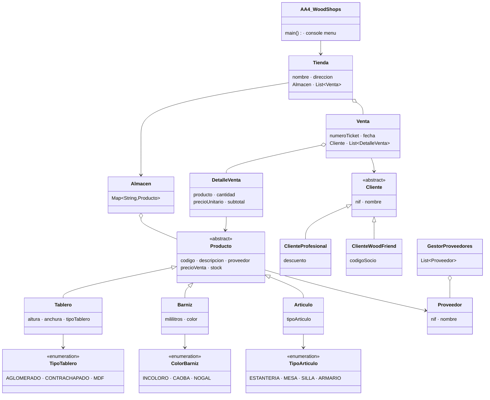
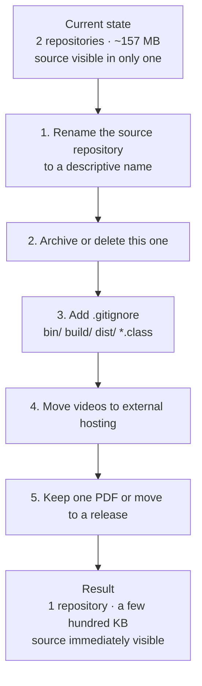

# woodshops — Distribution Artefact Repository · Architecture Specification

> **Scope of this document.** Every claim below is derived from the actual contents of this repository: the `.project` descriptor, the `Documentacion/` Javadoc tree, the packaged JAR under `Ejecutable/`, and the committed PDF and ZIP. **This repository contains no Java source files.** That fact shapes the entire document, and §5 explains what to do about it.

- **Repository:** `https://github.com/dadd86/woodshops` (branch `master`)
- **Course module:** FP056 — CFGS Desarrollo de Aplicaciones Multiplataforma
- **Author:** Diego Armando Diaz Devia
- **Single commit:** `2da1586` — *primer commit*, 2 January 2025
- **Spanish edition of this document:** [`docs/es/ARCHITECTURE.md`](docs/es/ARCHITECTURE.md)

---

## Table of Contents

1. [What This Repository Actually Contains](#1-what-this-repository-actually-contains)
2. [Documented System Architecture](#2-documented-system-architecture)
3. [Artefact Inventory](#3-artefact-inventory)
4. [Running the Packaged Application](#4-running-the-packaged-application)
5. [Consolidation Recommendation](#5-consolidation-recommendation)

---

## 1. What This Repository Actually Contains

### 1.1 Verified contents

```text
woodshops/
├── .project                                    # Eclipse descriptor (empty buildSpec and natures)
├── AA4(FP056)_DiazDevia_DiegoArmando.pdf        # Assignment deliverable
├── AA4(FP056)_DiazDevia_DiegoArmando.zip        # Archived project (contents not extracted here)
├── Documentacion/                               # Generated Javadoc — 65 HTML files
│   ├── index.html
│   ├── allclasses-index.html
│   ├── overview-tree.html
│   ├── aa4_woodshops/                           # Per-class documentation, 19 types
│   ├── index-files/
│   ├── legal/                                   # LICENSE, ASSEMBLY_EXCEPTION, etc.
│   ├── *.js                                     # Javadoc search indices
│   └── *.svg
├── Ejecutable/
│   └── AA4(FP056)_DiazDevia_DiegoArmando.jar    # Runnable JAR, 69 KB
└── W10DAM_20231211 [Corriendo] - ...mp4         # Demonstration recording
```

### 1.2 The defining fact

**Zero `.java` files.** A recursive search across the entire repository, excluding `.git`, returns no Java source.

This is therefore not a source repository. It is a **distribution and documentation artefact repository** for the WoodShops project, whose source lives in a different repository under the same account.

| Artefact class | Present | Count |
| --- | --- | --- |
| Java source (`.java`) | **No** | 0 |
| Compiled classes (`.class`) | No | 0 |
| Packaged JAR | Yes | 1 |
| Generated Javadoc HTML | Yes | 65 |
| Javadoc search index scripts (`.js`) | Yes | 10 |
| Build files (`build.xml`, `pom.xml`) | No | 0 |
| IDE descriptor | Yes (`.project`) | 1 |
| PDF deliverable | Yes | 1 |
| ZIP archive | Yes | 1 |
| Video recording | Yes | 1 |
| Tests | No | 0 |
| CI configuration | No | 0 |

### 1.3 Relationship to `AA5-FP056-_WoodShops`

The Javadoc in `Documentacion/aa4_woodshops/` documents exactly nineteen types:

`AA4_WoodShops`, `AA4_WoodShops.TipoProductoUtil`, `Almacen`, `Articulo`, `Barniz`, `Cliente`, `ClienteProfesional`, `ClienteWoodFriend`, `ColorBarniz`, `DetalleVenta`, `GestorProveedores`, `Producto`, `Proveedor`, `Tablero`, `Tienda`, `TipoArticulo`, `TipoTablero`, `Venta`, `WoodShops`.

That is the **identical type set** found in the source tree of the separate repository `AA5-FP056-_WoodShops`, in the same package `aa4_woodshops`.



The two repositories hold two builds of the same program: this one packages the **AA4** deliverable, the other holds the **AA5** source and its build. The JAR sizes differ (69 KB here, 74 KB there), consistent with AA5 being an extension of AA4 rather than a rename.

---

## 2. Documented System Architecture

The architecture described below is that of the WoodShops application as recorded in this repository's Javadoc. It is reproduced here so that this repository is self-contained for a reader who only has the artefacts.

For the full evidence-based specification derived from the source — including SOLID assessment, business-logic walkthroughs and known defects — see the [`ARCHITECTURE.md` of the `AA5-FP056-_WoodShops` repository](https://github.com/dadd86/AA5-FP056-_WoodShops/blob/master/ARCHITECTURE.md).

### 2.1 Application overview

WoodShops is a **console-based retail management system for a timber and carpentry supplies business**, written in Java SE with no external dependencies. It models a shop with a warehouse, a supplier registry, two categories of customer with different pricing, and a sales process producing itemised tickets.

All state is held in memory and discarded on exit. There is no database, no network interface and no graphical user interface.

### 2.2 Type structure



### 2.3 Documented types

| Type | Kind | Role |
| --- | --- | --- |
| `Producto` | Abstract class | Base for all catalogue items |
| `Tablero` | Class | Board — dimensions and board type |
| `Barniz` | Class | Varnish — volume and colour |
| `Articulo` | Class | Finished article — article type |
| `Cliente` | Abstract class | Base for customer categories |
| `ClienteProfesional` | Class | Professional customer with a discount |
| `ClienteWoodFriend` | Class | Member customer with a member code |
| `Proveedor` | Class | Supplier |
| `Almacen` | Class | Warehouse indexed by product code |
| `Tienda` | Class | Shop aggregate: warehouse plus sales log |
| `Venta` | Class | Sale with ticket, date, customer and line items |
| `DetalleVenta` | Class | Individual sale line |
| `GestorProveedores` | Class | Supplier registry |
| `TipoTablero` | Enum | 3 constants |
| `ColorBarniz` | Enum | 3 constants |
| `TipoArticulo` | Enum | 4 constants |
| `WoodShops` | Class | Secondary class |
| `AA4_WoodShops` | Class | Entry point and console menu |
| `AA4_WoodShops.TipoProductoUtil` | Nested class | Product-type selection helper |

---

## 3. Artefact Inventory

### 3.1 Javadoc tree

`Documentacion/` is a complete standard Javadoc output:

| Component | Purpose |
| --- | --- |
| `index.html` | Entry point |
| `allclasses-index.html`, `allpackages-index.html` | Type and package indices |
| `overview-tree.html` | Inheritance tree — the fastest way to see the two hierarchies |
| `aa4_woodshops/*.html` | Per-type documentation with fields, constructors and methods |
| `aa4_woodshops/package-use.html`, `class-use/` | Cross-reference of usage |
| `index-files/` | Alphabetical index, paginated |
| `member-search-index.js`, `type-search-index.js`, `package-search-index.js`, `module-search-index.js`, `tag-search-index.js` | Client-side search indices |
| `legal/` | `LICENSE`, `ASSEMBLY_EXCEPTION`, `ADDITIONAL_LICENSE_INFO` — standard JDK Javadoc boilerplate |
| `element-list` | Machine-readable element list for `-link` cross-referencing |

The presence of `element-list` means another project's Javadoc can cross-link into this one with `javadoc -link`.

### 3.2 Packaged application

| Property | Value |
| --- | --- |
| Path | `Ejecutable/AA4(FP056)_DiazDevia_DiegoArmando.jar` |
| Size | 69,094 bytes |
| Type | Runnable JAR with a `Main-Class` manifest entry |
| Dependencies | None — JDK standard library only |

### 3.3 The `.project` descriptor

```xml
<?xml version="1.0" encoding="UTF-8"?>
<projectDescription>
	<name>AA5(FP056)_DiazDevia_DiegoArmando</name>
	<comment></comment>
	<projects>
	</projects>
	<buildSpec>
	</buildSpec>
	<natures>
	</natures>
</projectDescription>
```

Note two things. The descriptor names the project **AA5**, while every other artefact in this repository is named **AA4** — the same naming inconsistency documented in the source repository. And `buildSpec` and `natures` are both empty, so Eclipse would import this as a plain folder with no Java nature and no builder attached. It cannot compile anything, which is consistent: there is nothing here to compile.

---

## 4. Running the Packaged Application

The JAR is self-contained and requires only a JRE:

```bash
java -jar "Ejecutable/AA4(FP056)_DiazDevia_DiegoArmando.jar"
```

Inspect the manifest without extracting:

```bash
unzip -p "Ejecutable/AA4(FP056)_DiazDevia_DiegoArmando.jar" META-INF/MANIFEST.MF
```

List the packaged classes:

```bash
unzip -l "Ejecutable/AA4(FP056)_DiazDevia_DiegoArmando.jar"
```

Browse the documentation by opening `Documentacion/index.html` in any browser. `overview-tree.html` is the most informative single page — it renders the full inheritance tree at a glance.

To obtain the source, clone the source repository instead:

```bash
git clone https://github.com/dadd86/AA5-FP056-_WoodShops.git
```

Or extract it from the ZIP committed here:

```bash
unzip "AA4(FP056)_DiazDevia_DiegoArmando.zip" -d extracted/
```

---

## 5. Consolidation Recommendation

This section is the practical point of the document.

### 5.1 The problem

Two repositories under the same account hold the same project:

| | `AA5-FP056-_WoodShops` | `woodshops` (this one) |
| --- | --- | --- |
| Java source | **Yes** — 18 files | No |
| Compiled classes | Yes — 19 `.class` | No |
| JAR | Yes — 74 KB (AA5) | Yes — 69 KB (AA4) |
| Javadoc | Yes — 65 HTML | Yes — 65 HTML |
| PDF deliverable | Yes (AA5) | Yes (AA4) |
| ZIP archive | Yes (AA5) | Yes (AA4) |
| Video | Yes — 46 MB | Yes |
| Repository size | ~96 MB | ~61 MB |

Roughly 157 MB of GitHub storage holds one program of 388 KB of source, and neither repository's name tells a visitor which one has the code. A recruiter clicking `woodshops` — the more natural-looking name of the two — finds a folder of generated HTML and a JAR, with no way to read a single line of the author's work.

### 5.2 Recommended action

**Archive or delete this repository, and consolidate on the source repository.**

Concretely:

1. **Rename `AA5-FP056-_WoodShops` to `woodshops-timber-retail`** (or similar) so the name describes the program rather than an assignment code.
2. **Delete or archive this repository.** Everything it holds is either duplicated there or regenerable from source (`javadoc`, `ant jar`).
3. **In the surviving repository, add a `.gitignore`** covering `bin/`, `build/`, `dist/`, `*.class`, and stop committing generated Javadoc — GitHub Pages can publish it from a workflow instead.
4. **Move the demonstration videos out of Git.** Between the two repositories they account for the overwhelming majority of ~157 MB. Host them externally and link from the `README.md`.
5. **Keep one PDF** as the assignment record, or move it to a release asset.

### 5.3 Why this matters beyond tidiness

Git retains every committed blob permanently. Deleting a 46 MB video in a later commit does not shrink the repository — every future `git clone` still downloads it. The only remedies are history rewriting or starting a fresh repository, and both are far easier to do on a small academic project now than on a larger one later.

For a portfolio, the arithmetic is stark: a visitor's first impression of `woodshops` is a repository with no code in it. The underlying program is genuinely well written — `BigDecimal` money arithmetic, fail-fast constructor validation, a correct `equals`/`hashCode` contract, immutable financial records. None of that is visible from here.



---

## Appendix A — Repository inventory

| Category | Count |
| --- | --- |
| Java source files | **0** |
| Compiled `.class` files | 0 |
| Packaged JARs | 1 (69 KB) |
| Javadoc HTML files | 65 |
| Javadoc search index scripts | 10 |
| Documented types | 19 |
| SVG assets | 2 |
| PDF deliverables | 1 |
| ZIP archives | 1 |
| Video recordings | 1 |
| Build files | 0 |
| Test classes | 0 |
| CI workflows | 0 |
| Repository size | ~61 MB |

## Appendix B — Related repositories

| Repository | Contents |
| --- | --- |
| [`AA5-FP056-_WoodShops`](https://github.com/dadd86/AA5-FP056-_WoodShops) | Full Java source (18 files), Ant build, compiled classes, AA5 JAR and Javadoc |
| `woodshops` (this repository) | AA4 Javadoc, AA4 JAR, PDF, ZIP, video — no source |
