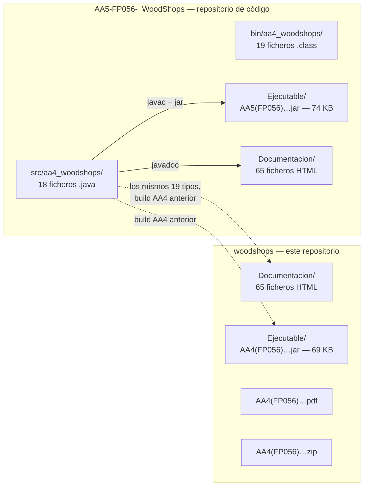
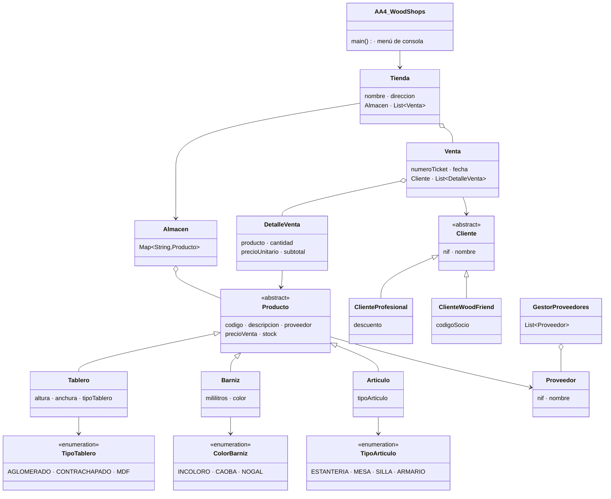
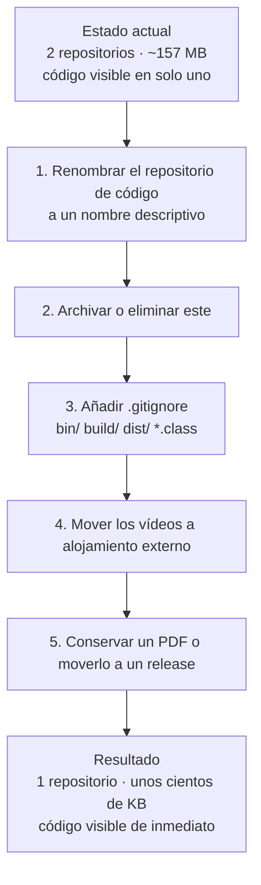

# woodshops — Repositorio de Artefactos de Distribución · Especificación de Arquitectura

> **Alcance de este documento.** Toda afirmación que sigue se deriva del contenido real de este repositorio: el descriptor `.project`, el árbol de Javadoc `Documentacion/`, el JAR empaquetado bajo `Ejecutable/` y el PDF y ZIP versionados. **Este repositorio no contiene ningún fichero fuente Java.** Ese hecho determina todo el documento, y el §5 explica qué hacer al respecto.

- **Repositorio:** `https://github.com/dadd86/woodshops` (rama `master`)
- **Módulo del curso:** FP056 — CFGS Desarrollo de Aplicaciones Multiplataforma
- **Autor:** Diego Armando Diaz Devia
- **Commit único:** `2da1586` — *primer commit*, 2 de enero de 2025
- **Edición en inglés de este documento:** [`ARCHITECTURE.md`](../../ARCHITECTURE.md)

---

## Índice

1. [Qué contiene realmente este repositorio](#1-qué-contiene-realmente-este-repositorio)
2. [Arquitectura del sistema documentado](#2-arquitectura-del-sistema-documentado)
3. [Inventario de artefactos](#3-inventario-de-artefactos)
4. [Ejecución de la aplicación empaquetada](#4-ejecución-de-la-aplicación-empaquetada)
5. [Recomendación de consolidación](#5-recomendación-de-consolidación)

---

## 1. Qué contiene realmente este repositorio

### 1.1 Contenido verificado

```text
woodshops/
├── .project                                    # Descriptor de Eclipse (buildSpec y natures vacíos)
├── AA4(FP056)_DiazDevia_DiegoArmando.pdf        # Entregable de la actividad
├── AA4(FP056)_DiazDevia_DiegoArmando.zip        # Proyecto archivado (contenido no extraído aquí)
├── Documentacion/                               # Javadoc generado — 65 ficheros HTML
│   ├── index.html
│   ├── allclasses-index.html
│   ├── overview-tree.html
│   ├── aa4_woodshops/                           # Documentación por clase, 19 tipos
│   ├── index-files/
│   ├── legal/                                   # LICENSE, ASSEMBLY_EXCEPTION, etc.
│   ├── *.js                                     # Índices de búsqueda de Javadoc
│   └── *.svg
├── Ejecutable/
│   └── AA4(FP056)_DiazDevia_DiegoArmando.jar    # JAR ejecutable, 69 KB
└── W10DAM_20231211 [Corriendo] - ...mp4         # Grabación de demostración
```

### 1.2 El hecho determinante

**Cero ficheros `.java`.** Una búsqueda recursiva en todo el repositorio, excluyendo `.git`, no devuelve ningún fuente Java.

Por tanto, esto no es un repositorio de código. Es un **repositorio de artefactos de distribución y documentación** del proyecto WoodShops, cuyo código fuente reside en otro repositorio de la misma cuenta.

| Clase de artefacto | Presente | Cantidad |
| --- | --- | --- |
| Fuentes Java (`.java`) | **No** | 0 |
| Clases compiladas (`.class`) | No | 0 |
| JAR empaquetado | Sí | 1 |
| HTML de Javadoc generado | Sí | 65 |
| Scripts de índice de búsqueda de Javadoc (`.js`) | Sí | 10 |
| Ficheros de construcción (`build.xml`, `pom.xml`) | No | 0 |
| Descriptor de IDE | Sí (`.project`) | 1 |
| Entregable PDF | Sí | 1 |
| Archivo ZIP | Sí | 1 |
| Grabación de vídeo | Sí | 1 |
| Pruebas | No | 0 |
| Configuración de CI | No | 0 |

### 1.3 Relación con `AA5-FP056-_WoodShops`

El Javadoc de `Documentacion/aa4_woodshops/` documenta exactamente diecinueve tipos:

`AA4_WoodShops`, `AA4_WoodShops.TipoProductoUtil`, `Almacen`, `Articulo`, `Barniz`, `Cliente`, `ClienteProfesional`, `ClienteWoodFriend`, `ColorBarniz`, `DetalleVenta`, `GestorProveedores`, `Producto`, `Proveedor`, `Tablero`, `Tienda`, `TipoArticulo`, `TipoTablero`, `Venta`, `WoodShops`.

Ese es el **conjunto de tipos idéntico** al que se encuentra en el árbol de fuentes del repositorio independiente `AA5-FP056-_WoodShops`, en el mismo paquete `aa4_woodshops`.



Los dos repositorios contienen dos compilaciones del mismo programa: este empaqueta el entregable **AA4**, el otro contiene el código **AA5** y su compilación. Los tamaños de los JAR difieren (69 KB aquí, 74 KB allí), lo que es coherente con que AA5 sea una ampliación de AA4 y no un simple cambio de nombre.

---

## 2. Arquitectura del sistema documentado

La arquitectura descrita a continuación es la de la aplicación WoodShops según la registra el Javadoc de este repositorio. Se reproduce aquí para que este repositorio sea autocontenido ante un lector que solo dispone de los artefactos.

Para la especificación completa basada en evidencia y derivada del código —incluida la evaluación SOLID, el recorrido por la lógica de negocio y los defectos conocidos— véase el [`ARCHITECTURE.md` del repositorio `AA5-FP056-_WoodShops`](https://github.com/dadd86/AA5-FP056-_WoodShops/blob/master/ARCHITECTURE.md).

### 2.1 Visión general de la aplicación

WoodShops es un **sistema de gestión comercial de consola para un negocio de madera y suministros de carpintería**, escrito en Java SE sin dependencias externas. Modela una tienda con un almacén, un registro de proveedores, dos categorías de cliente con precios distintos y un proceso de venta que produce tickets detallados.

Todo el estado se mantiene en memoria y se descarta al salir. No hay base de datos, ni interfaz de red, ni interfaz gráfica.

### 2.2 Estructura de tipos



### 2.3 Tipos documentados

| Tipo | Clase de tipo | Rol |
| --- | --- | --- |
| `Producto` | Clase abstracta | Base de todos los artículos del catálogo |
| `Tablero` | Clase | Tablero — dimensiones y tipo de tablero |
| `Barniz` | Clase | Barniz — volumen y color |
| `Articulo` | Clase | Artículo acabado — tipo de artículo |
| `Cliente` | Clase abstracta | Base de las categorías de cliente |
| `ClienteProfesional` | Clase | Cliente profesional con descuento |
| `ClienteWoodFriend` | Clase | Cliente socio con código de socio |
| `Proveedor` | Clase | Proveedor |
| `Almacen` | Clase | Almacén indexado por código de producto |
| `Tienda` | Clase | Agregado de tienda: almacén más registro de ventas |
| `Venta` | Clase | Venta con ticket, fecha, cliente y líneas |
| `DetalleVenta` | Clase | Línea individual de venta |
| `GestorProveedores` | Clase | Registro de proveedores |
| `TipoTablero` | Enum | 3 constantes |
| `ColorBarniz` | Enum | 3 constantes |
| `TipoArticulo` | Enum | 4 constantes |
| `WoodShops` | Clase | Clase secundaria |
| `AA4_WoodShops` | Clase | Punto de entrada y menú de consola |
| `AA4_WoodShops.TipoProductoUtil` | Clase anidada | Auxiliar de selección de tipo de producto |

---

## 3. Inventario de artefactos

### 3.1 Árbol de Javadoc

`Documentacion/` es una salida Javadoc estándar completa:

| Componente | Propósito |
| --- | --- |
| `index.html` | Punto de entrada |
| `allclasses-index.html`, `allpackages-index.html` | Índices de tipos y paquetes |
| `overview-tree.html` | Árbol de herencia — la vía más rápida para ver las dos jerarquías |
| `aa4_woodshops/*.html` | Documentación por tipo con campos, constructores y métodos |
| `aa4_woodshops/package-use.html`, `class-use/` | Referencias cruzadas de uso |
| `index-files/` | Índice alfabético, paginado |
| `member-search-index.js`, `type-search-index.js`, `package-search-index.js`, `module-search-index.js`, `tag-search-index.js` | Índices de búsqueda en cliente |
| `legal/` | `LICENSE`, `ASSEMBLY_EXCEPTION`, `ADDITIONAL_LICENSE_INFO` — texto estándar del Javadoc del JDK |
| `element-list` | Lista de elementos legible por máquina para referencias cruzadas con `-link` |

La presencia de `element-list` implica que el Javadoc de otro proyecto puede enlazar contra este mediante `javadoc -link`.

### 3.2 Aplicación empaquetada

| Propiedad | Valor |
| --- | --- |
| Ruta | `Ejecutable/AA4(FP056)_DiazDevia_DiegoArmando.jar` |
| Tamaño | 69.094 bytes |
| Tipo | JAR ejecutable con entrada `Main-Class` en el manifiesto |
| Dependencias | Ninguna — solo biblioteca estándar del JDK |

### 3.3 El descriptor `.project`

```xml
<?xml version="1.0" encoding="UTF-8"?>
<projectDescription>
	<name>AA5(FP056)_DiazDevia_DiegoArmando</name>
	<comment></comment>
	<projects>
	</projects>
	<buildSpec>
	</buildSpec>
	<natures>
	</natures>
</projectDescription>
```

Obsérvense dos cosas. El descriptor nombra el proyecto como **AA5**, mientras que todos los demás artefactos de este repositorio se llaman **AA4** — la misma inconsistencia de nomenclatura documentada en el repositorio de código. Y `buildSpec` y `natures` están ambos vacíos, de modo que Eclipse lo importaría como una carpeta plana sin naturaleza Java y sin constructor asociado. No puede compilar nada, lo cual es coherente: aquí no hay nada que compilar.

---

## 4. Ejecución de la aplicación empaquetada

El JAR es autocontenido y solo requiere un JRE:

```bash
java -jar "Ejecutable/AA4(FP056)_DiazDevia_DiegoArmando.jar"
```

Inspeccionar el manifiesto sin extraer:

```bash
unzip -p "Ejecutable/AA4(FP056)_DiazDevia_DiegoArmando.jar" META-INF/MANIFEST.MF
```

Listar las clases empaquetadas:

```bash
unzip -l "Ejecutable/AA4(FP056)_DiazDevia_DiegoArmando.jar"
```

Para consultar la documentación, abrir `Documentacion/index.html` en cualquier navegador. `overview-tree.html` es la página individual más informativa: muestra el árbol de herencia completo de un vistazo.

Para obtener el código fuente, clonar el repositorio de código:

```bash
git clone https://github.com/dadd86/AA5-FP056-_WoodShops.git
```

O extraerlo del ZIP versionado aquí:

```bash
unzip "AA4(FP056)_DiazDevia_DiegoArmando.zip" -d extracted/
```

---

## 5. Recomendación de consolidación

Esta sección es el objetivo práctico del documento.

### 5.1 El problema

Dos repositorios de la misma cuenta contienen el mismo proyecto:

| | `AA5-FP056-_WoodShops` | `woodshops` (este) |
| --- | --- | --- |
| Código Java | **Sí** — 18 ficheros | No |
| Clases compiladas | Sí — 19 `.class` | No |
| JAR | Sí — 74 KB (AA5) | Sí — 69 KB (AA4) |
| Javadoc | Sí — 65 HTML | Sí — 65 HTML |
| Entregable PDF | Sí (AA5) | Sí (AA4) |
| Archivo ZIP | Sí (AA5) | Sí (AA4) |
| Vídeo | Sí — 46 MB | Sí |
| Tamaño del repositorio | ~96 MB | ~61 MB |

Aproximadamente 157 MB de almacenamiento en GitHub albergan un único programa de 388 KB de código, y el nombre de ninguno de los dos repositorios indica al visitante cuál contiene el código. Un reclutador que pulse en `woodshops` —el nombre de aspecto más natural de los dos— encuentra una carpeta de HTML generado y un JAR, sin forma de leer una sola línea del trabajo del autor.

### 5.2 Acción recomendada

**Archivar o eliminar este repositorio y consolidar en el repositorio de código.**

En concreto:

1. **Renombrar `AA5-FP056-_WoodShops` a `woodshops-timber-retail`** (o similar) para que el nombre describa el programa y no un código de actividad.
2. **Eliminar o archivar este repositorio.** Todo lo que contiene está duplicado allí o es regenerable desde el código (`javadoc`, `ant jar`).
3. **En el repositorio superviviente, añadir un `.gitignore`** que cubra `bin/`, `build/`, `dist/`, `*.class`, y dejar de versionar el Javadoc generado — GitHub Pages puede publicarlo desde un workflow.
4. **Sacar de Git las grabaciones de vídeo.** Entre los dos repositorios representan la abrumadora mayoría de los ~157 MB. Alojarlas externamente y enlazarlas desde el `README.md`.
5. **Conservar un único PDF** como registro de la actividad, o moverlo a un activo de release.

### 5.3 Por qué esto importa más allá del orden

Git conserva permanentemente cada blob versionado. Eliminar un vídeo de 46 MB en un commit posterior no reduce el repositorio: cada `git clone` futuro sigue descargándolo. Los únicos remedios son reescribir el historial o empezar un repositorio nuevo, y ambos son mucho más fáciles de hacer ahora sobre un proyecto académico pequeño que más adelante sobre uno mayor.

Para un portafolio, la aritmética es contundente: la primera impresión que un visitante se lleva de `woodshops` es un repositorio sin código dentro. El programa subyacente está genuinamente bien escrito — aritmética monetaria con `BigDecimal`, validación fail-fast en constructores, un contrato `equals`/`hashCode` correcto, registros financieros inmutables. Nada de eso es visible desde aquí.



---

## Apéndice A — Inventario del repositorio

| Categoría | Cantidad |
| --- | --- |
| Ficheros fuente Java | **0** |
| Ficheros `.class` compilados | 0 |
| JAR empaquetados | 1 (69 KB) |
| Ficheros HTML de Javadoc | 65 |
| Scripts de índice de búsqueda de Javadoc | 10 |
| Tipos documentados | 19 |
| Activos SVG | 2 |
| Entregables PDF | 1 |
| Archivos ZIP | 1 |
| Grabaciones de vídeo | 1 |
| Ficheros de construcción | 0 |
| Clases de prueba | 0 |
| Workflows de CI | 0 |
| Tamaño del repositorio | ~61 MB |

## Apéndice B — Repositorios relacionados

| Repositorio | Contenido |
| --- | --- |
| [`AA5-FP056-_WoodShops`](https://github.com/dadd86/AA5-FP056-_WoodShops) | Código Java completo (18 ficheros), compilación Ant, clases compiladas, JAR y Javadoc de AA5 |
| `woodshops` (este repositorio) | Javadoc de AA4, JAR de AA4, PDF, ZIP, vídeo — sin código fuente |
